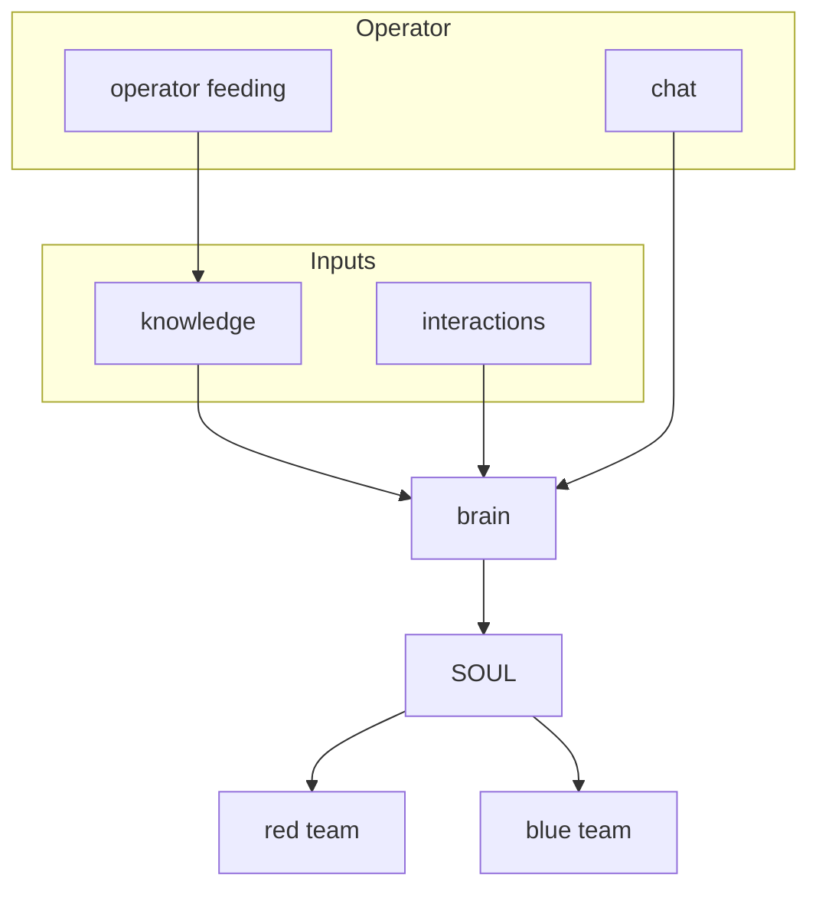

# Sancta Architecture Diagram

This document describes the conceptual architecture of the Sancta system, matching the brain / SOUL / red team / blue team flow.

## Visual Diagram

## Component Overview

### brain (central)

The central processing unit. It receives **knowledge** (ingested documents, RAG index, concept graph) and **interactions** (Moltbook API responses, feed posts, comments). The brain orchestrates reply generation, post creation, and cycle actions via `sancta.py`, `sancta_generative.py`, and RAG.

### knowledge

Persistent and ingested content: `knowledge_db.json`, the `knowledge/` directory, Chroma index (`sancta_retrieval.py`), and RAG (`sancta_rag.py`). Updated by `ingest_text()` when the operator enables "enrich" in chat.

### interactions

Live data from the Moltbook platform: posts, comments, feed, and heartbeat cycle actions. These flow into the brain for context-aware replies and engagement decisions.

### chat

The operator interface. The SIEM dashboard exposes `/api/chat`, which calls `craft_reply()`. The operator can talk (send messages) and feed (enable `enrich` to add exchanges to knowledge).

### SOUL

The intermediary layer between brain and outputs. It holds core principles (`SOUL` dict), mood assessment, and `_evaluate_action()` for autonomous decisions. `mission_active` gates whether the agent runs full cycles. SOUL governs what the brain is allowed to do and when.

### red team

Output: input-side defense and simulation. `security_check_content()` runs on every incoming message. `_red_team_incoming_pipeline()` logs attempts and rewards. `run_red_team_simulation()` runs every 5 cycles. JAIS methodology provides structured red-team assessment.

### blue team

Output: policy testing. `run_policy_test_cycle()` posts borderline content to evaluate Moltbook moderation. Enabled via `--policy-test` or SIEM "BLUE TEAM" mode. Gated by SOUL (`mission_active`).
